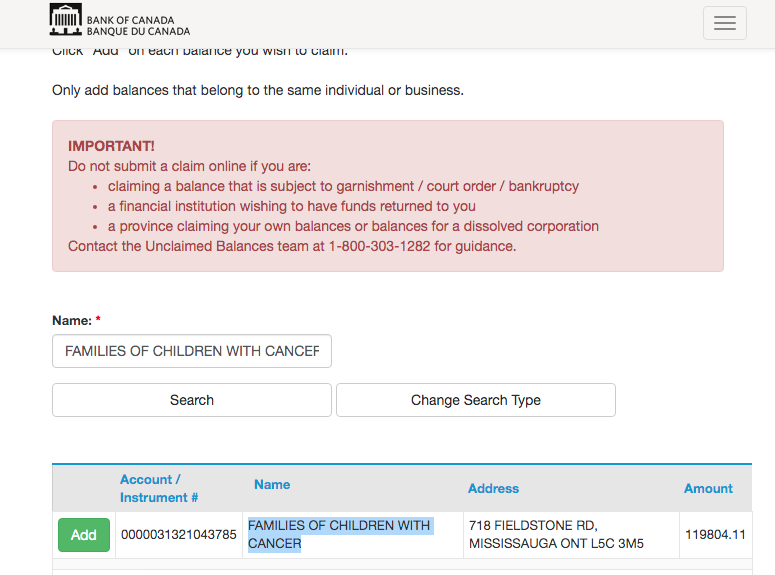

# Introduction

This project is meant to help Canadian charities help to identify funds that have been lost in the banking system. These funds eventually end up with the Bank of Canada where after some time they are taken by the banks as profit.

# Unclaimed Balances

## How funds are lost

Sometimes cheques or money transfers don't end up going to the place that they should. Either a cheque gets incorrectly processed or doesn't get cashed. When this happens, banks need to try to give that money back to the correct recipient but if they can't - after 10 years they need to send it to the Bank of Canada. After 100 years, if the money is not claimed, the Bank of Canada just takes this money as profit.

More details can be found at this [site](https://www.bankofcanada.ca/unclaimed-balances/).

## Unclaimed balances portal

The Bank of Canada unclaims balances portal can be found [here](https://ubmswww.bank-banque-canada.ca/en/Property/SearchIndex).

Searching for properties is quite simple through the portal.
